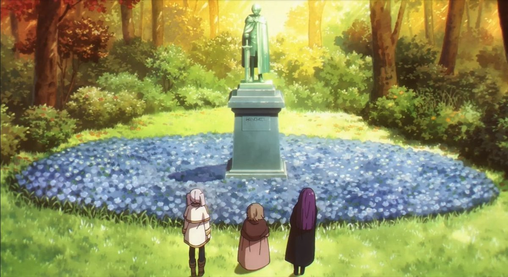

# Hello There 👋

I’m a professional fullstack web developer specializing in building immersive 3D web experiences such as games, product visualizations, and virtual tours. I spent most of my time working on personal projects and exploring creative ideas, but my inbox is always open. Feel free to reach out anytime — I’d love to connect with you.

## Skills

  

Javascript
  
  
**Expertise:** Expert  
  
My primary language and daily comfort zone. I build most of my projects with JavaScript and am also highly proficient with TypeScript for large-scale and maintainable applications.  
  

  
  

  

HTML
  
  
**Expertise:** Expert  
  
The foundation of every web project I build. I use semantic HTML to ensure my applications are not only visually functional but also accessible and well-structured.  
  

  
  

  

CSS
  
  
**Expertise:** Expert  
  
I use CSS to elevate both usability and visual quality. I'm comfortable working with standard CSS, preprocessors, Tailwind CSS, and CSS-in-JS solutions, choosing the right approach based on each project's specific needs.  
  

  
  

  

Three.js
  
  
**Expertise:** Expert  
  
My preferred 3D rendering library for the web. I have experience building custom geometries, materials, shaders, and implementing more advanced real-time rendering techniques.  
  

  
  

  

GLSL
  
  
**Expertise:** Intermediate  
  
I can write custom shader code to optimize rendering performance and handle more advanced visual effects or rendering use cases.  
  

  
  

  

Blender
  
  
**Expertise:** Intermediate  
  
I use Blender to tweak existing assets or create simple 3D models from scratch when needed. I’m comfortable with basic modeling and asset preparation workflows.  
  

  
  

  

React.js
  
  
**Expertise:** Expert  
  
When speed, scalability, and maintainability are priorities, React is my go-to solution. I leverage its ecosystem effectively while also being comfortable building custom solutions when required.  
  

  
  

  

Go
  
  
**Expertise:** Intermediate  
  
I have around 1.5 years of experience building backend applications with Go, including complex systems. I also use it to create custom tools and utilities for personal projects.  
  

  
  

  

Supabase
  
  
**Expertise:** Intermediate  
  
My preferred choice for quickly building backend services. I mainly use it for database management, authentication, and object storage.  
  

## AI

I see AI as a powerful technology that drives new innovation, and I use it to support my workflow and improve productivity. However, I never let AI take the wheel. As an engineer, I’m responsible for everything I build, and I believe I should understand every line of code I ship.

My focus is not just on speed or following trends, but on building solutions that are reliable, scalable, and maintainable in the long run.

## Projects
some curated project i've worked in the past, some are still on going progress

<video controls autoplay muted loop playsinline>
	<source src='/assets/cozy-place.mp4' type='video/mp4' />
</video>

	

	**Himmel Statue**
	

	*Live* : [`link`] (https://irvancolz.github.io/himmel_statue/)
	*Stack* : Three.Js, Javascript, Sass,
	
	my entry for [`ThreeJsJourney`](https://threejs-journey.com/challenges/020-cozy-place#) challenge, inspired by Himmel statue in the middle of forest 	 from Frieren's journey end Anime.
	
	

<video controls autoplay muted loop playsinline>
	<source src='/assets/room-planner.mp4' type='video/mp4' />
</video>

	

	**Room Planner (on going)**
	

	*Live* : [`link`] (https://custom-room-organizer.netlify.app/)
	*Stack* : Three.Js, Javascript, Sass,
	
	custom room organizer with advanced spatial querying for objects collision detection and integrated customizer feature for each object

<video controls autoplay muted loop playsinline>
	<source src='/assets/light-shader.mp4' type='video/mp4' />
</video>

	

	**Glass Shader experiment**
	

	*Live* : '-'
	*Stack* : Three.Js, Javascript
	
	my exploration to learn more about PBR light shading based no [`this`](https://blog.maximeheckel.com/posts/refraction-dispersion-and-other-shader-light-effects/) article

<video controls autoplay muted loop playsinline>
	<source src='/assets/apple-physics.mp4' type='video/mp4' />
</video>

	

	**Blender to Three.js Integration**
	

	*Live* : '-'
	*Stack* : Three.Js, Javascript, Blender
	
	made custom model in Blender then import it into Three.js to add custom interactions and custom physics.

## Contacts

talk to me anytime at : 
 - [`x`](https://x.com/IrvanSahar77574)
 -  [`Linkedin`](https://www.linkedin.com/in/irvan-saharudin-a2289a23a/)
 - [`Instagram`](https://www.instagram.com/ipan_sahaludin2?igsh=M2VqZXF5dzRqZjNj)
 - [`Bluesky`](https://bsky.app/profile/irvancolz.bsky.social)
 - [`Youtube`](https://www.youtube.com/@irvansaharudin)
